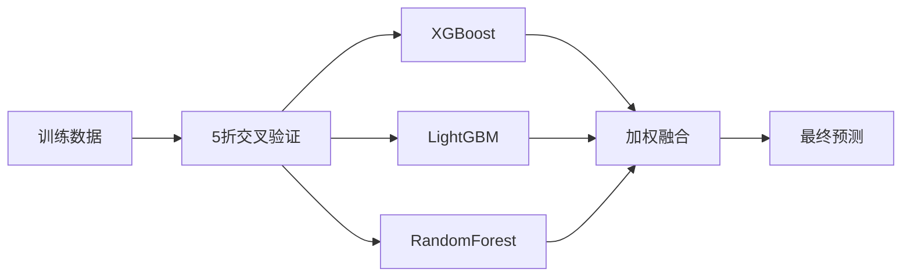

<p align="center">
  
</p>

<p align="center">
  <b>基于集成学习的房价预测模型 · 从数据清洗到 Kaggle 提交的完整竞赛方案</b>
</p>

<p align="center">
  
  
  
  
  
  
</p>

---

## 📊 项目成绩

<p align="center">
  <table>
    <tr>
      <td align="center"><b>🏆 排名</b></td>
      <td align="center"><b>📊 参赛队伍</b></td>
      <td align="center"><b>📈 百分位</b></td>
      <td align="center"><b>📉 验证集 RMSLE</b></td>
    </tr>
    <tr>
      <td align="center"><b>#347</b></td>
      <td align="center">4,039</td>
      <td align="center"><b>Top 8.6%</b></td>
      <td align="center"><b>0.119</b></td>
    </tr>
  </table>
</p>

> 💡 **说明**：Kaggle 使用 **50% 测试数据**计算 Public Score，最终排名在 4039 支队伍中位列前 9%。

---

## 📖 项目简介

> 这是集美大学 **机器学习课程设计** 的结课项目，基于 Kaggle 经典竞赛 **Housing Prices: Advanced Regression Techniques**。

本项目完成了从**数据清洗 → 特征工程 → 模型训练 → 交叉验证 → 模型融合 → 预测提交**的完整机器学习流程，最终在 Kaggle 公开排行榜上取得 **前 8.6%** 的优异成绩。

### 🎯 核心任务
- **输入**：79 个房屋特征（面积、年份、位置、质量等）
- **输出**：SalePrice（房屋售价）
- **本质**：监督学习 → 回归问题 → 连续值预测

---

## 🔍 技术方案

### 📌 特征工程（核心亮点）

| 类型 | 操作 | 说明 |
| :--- | :--- | :--- |
| **缺失值处理** | 分类填充 'None' / 数值中位数填充 | 针对不同特征类型差异化处理 |
| **对数变换** | `log(1+x)` | 对 18 个右偏特征进行平滑处理 |
| **组合特征** | `TotalSF`, `TotalBath`, `Age`, `IsRemod` | 提升模型表达能力 |
| **目标编码** | Neighborhood → 平均 SalePrice | 利用地理信息增强预测 |
| **类别编码** | LabelEncoder | 所有分类变量数值化 |

### 📌 模型策略



| 模型 | 验证集 RMSLE (5折平均) |
| :--- | :--- |
| XGBoost | 0.120 |
| LightGBM | 0.121 |
| RandomForest | 0.135 |
| **融合模型 (Ensemble)** | **0.119** |

融合权重：`XGB(0.4) + LGB(0.4) + RF(0.2)`

---

## 📂 项目结构

```text
house-price-prediction/
│
├── train.csv                 # 📊 Kaggle 训练集 (1460条)
├── test.csv                  # 📊 Kaggle 测试集 (1459条)
├── sample_submission.csv     # 📄 提交格式参考
│
├── house_price_highscore.py  # 🚀 主程序（完整流程）
├── my_submission.csv         # 📤 最终生成的提交文件
│
├── images/                   # 🖼️ 截图与可视化
│   └── leaderboard.png       #    Kaggle 排名截图
│
└── README.md                 # 📖 项目文档
```

---

## 🚀 快速开始

### 1️⃣ 克隆仓库

```bash
git clone https://github.com/your-username/house-price-prediction.git
cd house-price-prediction
```

### 2️⃣ 安装依赖

```bash
pip install pandas numpy scikit-learn xgboost lightgbm
```

### 3️⃣ 运行主程序

```bash
python house_price_highscore.py
```

### 4️⃣ 生成提交文件

程序运行后会在当前目录生成 `my_submission.csv`，直接上传到 Kaggle 即可。

---

## 📌 核心代码预览

```python
# 特征工程核心代码
skew_cols = ['LotArea', 'GrLivArea', 'TotalBsmtSF', 'GarageArea']
for col in skew_cols:
    all_data[col] = np.log1p(all_data[col])

# 创建组合特征
all_data['TotalSF'] = all_data['TotalBsmtSF'] + all_data['1stFlrSF'] + all_data['2ndFlrSF']
all_data['TotalBath'] = (all_data['FullBath'] + 0.5*all_data['HalfBath'] + 
                         all_data['BsmtFullBath'] + 0.5*all_data['BsmtHalfBath'])

# 模型融合
model_xgb = XGBRegressor(n_estimators=2000, learning_rate=0.01, max_depth=5)
model_lgb = LGBMRegressor(n_estimators=2000, learning_rate=0.01, max_depth=5)
model_rf = RandomForestRegressor(n_estimators=500, max_depth=20)

# 加权平均
final_pred = 0.4 * pred_xgb + 0.4 * pred_lgb + 0.2 * pred_rf
```


---


## 🧠 技术栈

| 工具 | 用途 |
| :--- | :--- |
| Python 3.11 | 编程语言 |
| Pandas / NumPy | 数据处理 |
| Scikit-Learn | 交叉验证 / 预处理 / 随机森林 |
| XGBoost / LightGBM | 梯度提升树模型 |
| Matplotlib / Seaborn | 可视化分析 |
| Kaggle | 竞赛平台与模型验证 |

---

## 🧑‍💻 作者

**Lenlon**  
- 集美大学 · 数据科学与大数据技术 · 2313班
- GitHub: [@lenlon](https://github.com/lenlonalice5-collab)

---

## 📜 许可证

MIT License © 2025 Lenlon

---

<p align="center">
  <b>⭐ 如果这个项目对你有帮助，欢迎 Star 支持！</b>
</p>
```
